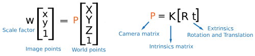
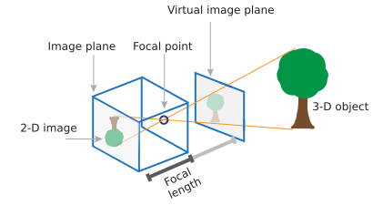
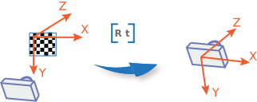
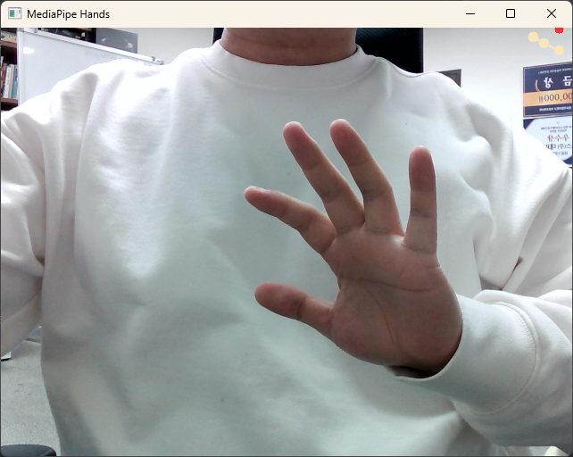

# 3D Hand Pose Estimation 공부한 것 정리

## 라이브러리

- OpenCV
  
  - 컴퓨터 비전, 머신 러닝 오픈소스 라이브러리
  
  - 다른 라이브러리나 프레임워크와 함께 사용하면 큰 시너지 발휘함.

- MediaPipe
  
  - Google에서 개발한 오픈소스 라이브러리
  
  - 컴퓨터 비전과 머신 러닝을 기반 미디어 파이프라인 구축
  
  - 객체 탐지, 자세 추적, 얼굴 인식, 자연어 처리 등에 사용
  
  - TensorFlow 기반
  
  - 이 과제에서 Hands 솔루션 활용하여 문제 해결

## SolvePnP

### 정의

> "solvePnP" is a computer vision algorithm that stands for "solve Perspective-n-Point." It is used to estimate the 3D pose (position and orientation) of an object in a camera image, given the 2D location of certain points on that object.
> 
> The algorithm takes in as input the 2D coordinates of several known points in the image and their corresponding 3D coordinates in the object's coordinate system. The algorithm then uses this information to estimate the camera's extrinsic parameters (position and orientation) and intrinsic parameters (focal length, principal point, etc.) relative to the object.
> 
> The solvePnP algorithm is widely used in computer vision applications such as robotics, augmented reality, and object tracking. It is often used in conjunction with other computer vision techniques, such as feature detection and matching, to achieve more accurate and robust object tracking and pose estimation.

- 카메라 이미지에서 특정 포인트의 2D 위치가 지정된 경우 해당 객체의 3D 포즈(위치 및 방향)를 추정

- 카메라의 위치와 방향을 알 수있다.

- 체커보드를 기준으로 하는 좌표계 반환

### Python cv2.solvePnP

```python
ret, rvecs, tvecs = cv2.solvePnP(object_points, main_points, matrix, distortion)
```

- 입력
  
  - objectPoints: 원본 이미지
  
  - imagePoints: 카메라로 비춘 이미지
  
  - cameraMatrix: 카메라 캘리브레이션 정보 3 x 3 행렬. 
  
  - distCoeffs: 왜곡 계수. NULL로 사용 가능

- 반환
  
  - retval: return value
  
  - rvec: rotation vector
  
  - tvec: translation vector

- Rodrigues' rotation formula
  
  - 3차원 회전변환
  
  - **회전축 벡터 + 회전각**

## camera calibration




### 정의

카메라 렌즈, 영상 센서에 대한 파라미터 추정 (렌즈 왜곡 등)

- solvePnP를 하기 위해 거쳐야하는 과정

- pinhole camera
  

- https://kr.mathworks.com/help/vision/ug/camera-calibration.html

- 카메라 파라미터: 3x4 행렬

- 현실(3차원)을 영상(2차원)에 매핑

- 외부 파라미터 [R t]
  
  
  - R: 회전
  
  - T: 평행이동

- 내부 파라미터 [3x3]
  
  
  
  - forcal length
  
  - principal point
  
  - 왜도 계수

### Python cv2.camera calibration

```python
# 체스보드 코너 포인트를 계산할 체스보드 이미지 파일 경로
chessboard_img_path = 'checkerboard.png'

# 체스보드 가로, 세로 코너 포인트 개수
chessboard_size = (10, 7)

# 체스보드 패턴에서의 3D 좌표 생성
object_points = np.zeros((chessboard_size[0] * chessboard_size[1], 3), np.float32)
object_points[:, :2] = np.mgrid[0:chessboard_size[0], 0:chessboard_size[1]].T.reshape(-1, 2)

# 저장된 이미지에서 체스보드 코너 포인트 검출
img = cv2.imread(chessboard_img_path)
gray = cv2.cvtColor(img, cv2.COLOR_BGR2GRAY)
ret, corners = cv2.findChessboardCorners(gray, chessboard_size, None)

# 내부 매개변수 및 왜곡 계수 계산
ret, mtx, dist, rvecs, tvecs = cv2.calibrateCamera([object_points], [corners], gray.shape[::-1], None, None)

return ret, mtx, dist, rvecs, tvecs
```

- 입력
  
  - objectPoints: 원본 이미지의 좌표
  
  - imagePoints: 카메라로 본 이미지의 코너
  
  - gray.shape[::-1]: 이미지 크기

- 반환
  
  - retval: return value
  
  - mtx: 카메라 캘리브레이션 정보 3 x 3 행렬.
  
  - dst: 왜곡 계수. NULL로 사용 가능
  
  - rvec: rotation vector
  
  - tvec: translation vector

## MediaPipe Hand

```python
mp_hands = mp.solutions.hands # mediapipe의 Hand import
cap = cv2.VideoCapture(0)

with mp_hands.Hands(min_detection_confidence=0.6,
                    min_tracking_confidence=0.6) as hands:
    while cap.isOpened():
        success, image = cap.read()
        if not success:
            print("Ignoring empty camera frame.")
            continue

        image.flags.writeable = False
        results = hands.process(image) # 손 인식
        image_height, image_width, _ = image.shape # 카메라 해상
        image.flags.writeable = True

        if results.multi_hand_landmarks:
            for hand_landmarks in results.multi_hand_landmarks: # 손의 이미지 상 좌표
                for landmrk in hand_landmarks.landmark:
                    cx, cy = landmrk.x * image_width, landmrk.y * image_height
                    np.append(main_points, [[cx, cy]])

            for hand_landmarks in results.multi_hand_world_landmarks: # 손의 world 좌표
                for landmrk in hand_landmarks.landmark:
                    cx, cy = landmrk.x * image_width, landmrk.y * image_height
                    np.append(main_points, [[cx, cy]])

        cap.release()
```


- results.multi_hand_landmarks
  
  > field that contains the hand landmarks on each detected hand.
  > 
  > Collection of detected/tracked hands, where each hand is represented as a list of 21 hand landmarks and each landmark is composed of `x`, `y` and `z`. `x` and `y` are normalized to `[0.0, 1.0]` by the image width and height respectively. `z` represents the landmark depth with the depth at the wrist being the origin, and the smaller the value the closer the landmark is to the camera. The magnitude of `z` uses roughly the same scale as `x`.
  
  - 손의 좌표를 이미지에 나타냄
  
  - x, y: 이미지
  
  - z: 손목에서의 상대 위치



- results.multi_hand_world_landmarks
  
  > field that contains the hand landmarks  on each detected hand in real-world 3D coordinates that are in meters with the origin at the hand's approximate geometric center.
  > 
  > real-world 3D coordinates in meters with the origin at the hand’s approximate geometric center.
  
  - 손의 기하학적 중심을 원점으로 각 랜드마크의 상대적 거리

## 3D Hand Pose Estimation for Monocular Camera

### Hand의 좌표계와 체커보드의 좌표계 동기화


### MediaPipe 내부에 있는 요소 활용


출처: Lugaresi, C., Tang, J., Nash, H., McClanahan, C., Uboweja, E., Hays, M., ... & Grundmann, M. (2019). Mediapipe: A framework for building perception pipelines. *arXiv preprint arXiv:1906.08172*.

미디어파이프 Hand를 찾는 알고리즘

1. Hand Detection. SSD(Single Shot MultiBox Detector)로 손바닥(palm)을 찾는 pre-trained 모델로 손 위치 찾기

2. 손의 대략적인 위치를 찾으면 이미지 크롭

3. Hand Landmark Model로 각 관절의 위치를 랜드마크로

4. visualize

5. 2~4 반복. 만약 손이 사라지면 다시 1번으로 돌아가서 손 위치를 찾는다.
- 미디어파이프 코드 내부에 있는 Hand Detection 모델을 응용

- multi_hand_world_landmarks에
